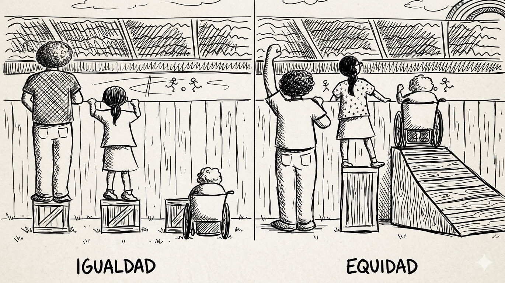

```{r}
#| label: setup
#| include: false
#| cache: false
# No se requieren librerías específicas para esta presentación
# Si deseas usar imágenes locales, asegúrate de tener la carpeta "img"
```

----------------------------------------------

## ¿Por qué este tema es urgente?

::: {=html}
<div style="position: relative; margin-top: 40px; width: 100%; height: 450px;">
<div style="position: absolute; top: 18px; left: 5%; right: 5%; height: 4px; background: linear-gradient(90deg, #3b82f6 0%, #99229b 33%, #cf2d7d 66%, #ef4444 100%); z-index: 1; opacity: 0.6;"></div>
<div style="display: flex; justify-content: space-between; align-items: flex-start; gap: 15px; position: relative; z-index: 2;">

<div class="fragment" style="flex: 1; display: flex; flex-direction: column; align-items: center; text-align: center;">
<div style="width: 32px; height: 32px; border-radius: 50%; background: #3b82f6; border: 4px solid #fff; margin-bottom: 20px; box-shadow: 0 0 15px rgba(59,130,246,0.4);"></div>
<div style="background: rgba(248,249,250,0.05); border: 1px solid rgba(255,255,255,0.1); border-radius: 12px; padding: 15px; width: 100%; min-height: 180px;">
<span style="font-size: 1.4em; font-weight: 800; color: #3b82f6; display: block; line-height: 1;">33.3%</span>
<span style="font-size: 0.7em; font-weight: bold; color: #fff; display: block; margin-top: 5px;">CIENTÍFICAS</span>
<p style="font-size: 0.55em; margin-top: 10px; line-height: 1.4; color: #94a3b8;">1 de cada 3 personas en investigación global son mujeres.</p>
</div>
</div>

<div class="fragment" style="flex: 1; display: flex; flex-direction: column; align-items: center; text-align: center;">
<div style="width: 32px; height: 32px; border-radius: 50%; background: #99229b; border: 4px solid #fff; margin-bottom: 20px; box-shadow: 0 0 15px rgba(153,34,155,0.4);"></div>
<div style="background: rgba(248,249,250,0.05); border: 1px solid rgba(255,255,255,0.1); border-radius: 12px; padding: 15px; width: 100%; min-height: 180px;">
<span style="font-size: 1.4em; font-weight: 800; color: #99229b; display: block; line-height: 1;">22%</span>
<span style="font-size: 0.7em; font-weight: bold; color: #fff; display: block; margin-top: 5px;">PUESTOS STEM</span>
<p style="font-size: 0.55em; margin-top: 10px; line-height: 1.4; color: #94a3b8;">Representación real en ingeniería y tecnología (G20).</p>
</div>
</div>

<div class="fragment" style="flex: 1; display: flex; flex-direction: column; align-items: center; text-align: center;">
<div style="width: 32px; height: 32px; border-radius: 50%; background: #cf2d7d; border: 4px solid #fff; margin-bottom: 20px; box-shadow: 0 0 15px rgba(207,45,125,0.4);"></div>
<div style="background: rgba(248,249,250,0.05); border: 1px solid rgba(255,255,255,0.1); border-radius: 12px; padding: 15px; width: 100%; min-height: 180px;">
<span style="font-size: 1.4em; font-weight: 800; color: #cf2d7d; display: block; line-height: 1;">&lt; 10%</span>
<span style="font-size: 0.7em; font-weight: bold; color: #fff; display: block; margin-top: 5px;">OPEN SOURCE</span>
<p style="font-size: 0.55em; margin-top: 10px; line-height: 1.4; color: #94a3b8;">Participación marginal en comunidades de código abierto.</p>
</div>
</div>

<div class="fragment" style="flex: 1; display: flex; flex-direction: column; align-items: center; text-align: center;">
<div style="width: 32px; height: 32px; border-radius: 50%; background: #ef4444; border: 4px solid #fff; margin-bottom: 20px; box-shadow: 0 0 15px rgba(239,68,68,0.4);"></div>
<div style="background: rgba(248,249,250,0.05); border: 1px solid rgba(255,255,255,0.1); border-radius: 12px; padding: 15px; width: 100%; min-height: 180px;">
<span style="font-size: 1.4em; font-weight: 800; color: #ef4444; display: block; line-height: 1;">&lt; 3%</span>
<span style="font-size: 0.7em; font-weight: bold; color: #fff; display: block; margin-top: 5px;">CORE COMMITS</span>
<p style="font-size: 0.55em; margin-top: 10px; line-height: 1.4; color: #94a3b8;">Presencia mínima en repositorios clave como Python.</p>
</div>
</div>

</div>
</div>
:::

<div style="text-align: center; margin-top: 20px; font-size: 0.45em; color: #666;">
*La Tubería Rota de STEM: El filtro sistémico que reduce la presencia femenina.*
</div>

-----------------------------------------------

## La paradoja de la ciencia abierta

<div style="margin-top: 20px; width: 100%; font-family: system-ui, -apple-system, sans-serif;">

<p style="font-size: 0.75em; color: #64748b; margin-bottom: 25px; line-height: 1.5; text-align: left;">
La ciencia abierta promete democratizar el conocimiento, pero ¿realmente está siendo inclusiva?
</p>

<div style="display: flex; gap: 20px; width: 100%; align-items: stretch; text-align: left;">

<div class="fragment" style="flex: 1; background-color: #f0fdf4; border-left: 5px solid #16a34a; border-radius: 4px; padding: 20px; box-shadow: 0 2px 4px rgba(0,0,0,0.02);">
<h3 style="font-size: 0.7em; font-weight: 800; color: #16a34a; margin: 0 0 10px 0; text-transform: uppercase; letter-spacing: 0.5px;">Mayor Afinidad</h3>
<p style="font-size: 0.55em; color: #334155; margin: 0 0 15px 0; line-height: 1.5;">
Las investigadoras se involucran más en prácticas de Ciencia Abierta que sus colegas hombres.
</p>
<div style="border-top: 1px dashed #bbf7d0; padding-top: 12px;">
<span style="font-size: 0.5em; font-weight: bold; color: #15803d; display: block; margin-bottom: 2px;">📈 TENDENCIA POSITIVA</span>
<p style="font-size: 0.5em; color: #475569; margin: 0; line-height: 1.4;">
La participación femenina en la Ciencia Abierta muestra un crecimiento incremental constante.
</p>
</div>
</div>

<div class="fragment" style="flex: 1; background-color: #fff1f2; border-left: 5px solid #e11d48; border-radius: 4px; padding: 20px; box-shadow: 0 2px 4px rgba(0,0,0,0.02);">
<h3 style="font-size: 0.7em; font-weight: 800; color: #e11d48; margin: 0 0 10px 0; text-transform: uppercase; letter-spacing: 0.5px;">Paradoja del Valor</h3>
<p style="font-size: 0.55em; color: #334155; margin: 0 0 15px 0; line-height: 1.5;">
Estas contribuciones abiertas suelen ser menos valoradas que los méritos tradicionales en las evaluaciones.
</p>
<div style="background: rgba(225, 29, 72, 0.05); border: 1px solid rgba(225, 29, 72, 0.2); border-radius: 6px; padding: 10px; display: flex; align-items: center; gap: 12px;">
<span style="font-size: 1.1em; font-weight: 900; color: #e11d48; line-height: 1;">12%</span>
<p style="font-size: 0.45em; color: #64748b; margin: 0; line-height: 1.3;">
<strong style="color: #e11d48;">Techo de cristal STEM:</strong> Puestos directivos ocupados por mujeres (frente al 27.5% en otros sectores).
</p>
</div>
</div>

</div>
</div>

------------------------------------------------------

## Lo que (no) vemos: barreras invisibles

::: {style="display: flex; gap: 12px; margin-top: 30px; width: 100%;"}

<!-- Tarjeta 1: Impostor -->
<div class="fragment" style="flex: 1; background-color: #f8f9fa; border-top: 4px solid #99229B; padding: 15px; border-radius: 6px; box-shadow: 0 2px 4px rgba(0,0,0,0.03);">
  <span style="font-size: 0.75em; font-weight: bold; display: block;">Efecto Impostor</span>
  <span style="font-size: 0.52em; display: block; margin-top: 6px; line-height: 1.3; color: #475569;">Muchas candidatas subestiman sus habilidades técnicas o asumen no estar calificadas para el entorno.</span>
</div>

<!-- Tarjeta 2: Entornos -->
<div class="fragment" style="flex: 1; background-color: #f8f9fa; border-top: 4px solid #cf2d7d; padding: 15px; border-radius: 6px; box-shadow: 0 2px 4px rgba(0,0,0,0.03);">
  <span style="font-size: 0.75em; font-weight: bold; display: block;">Entornos Hostiles</span>
  <span style="font-size: 0.52em; display: block; margin-top: 6px; line-height: 1.3; color: #475569;">Investigación documenta experiencias negativas sistemáticas de las mujeres en comunidades OSS.</span>
</div>

<!-- Tarjeta 3: Decisiones -->
<div class="fragment" style="flex: 1; background-image: linear-gradient(135deg, #1e1b4b, #0f172a); color: white; padding: 15px; border-radius: 6px; box-shadow: 0 4px 10px rgba(0,0,0,0.15);">
  [**Brecha Decisoria**]{style="font-size: 0.75em; float: left;"} [**7%**]{style="font-size: 0.9em; color: #ff47a4; float: right; font-weight: 800;"}
  <div style="clear: both;"></div>
  <span style="font-size: 0.52em; display: block; margin-top: 6px; line-height: 1.3; color: #cbd5e1;">Las mujeres ocupan apenas el 7% de puestos de liderazgo y directivas en el Software Libre.</span>
</div>

<!-- Tarjeta 4: Referentes -->
<div class="fragment" style="flex: 1; background-color: #f8f9fa; border-top: 4px solid #f59e0b; padding: 15px; border-radius: 6px; box-shadow: 0 2px 4px rgba(0,0,0,0.03);">
  <span style="font-size: 0.75em; font-weight: bold; display: block;">Falta de Referentes</span>
  <span style="font-size: 0.52em; display: block; margin-top: 6px; line-height: 1.3; color: #475569;">Escasa visibilidad pública de mujeres programadoras y hackers como modelos a seguir.</span>
</div>

:::

<div style="text-align: center; margin-top: 35px; font-size: 0.45em; color: #666;">
*Barreras estructurales de género en el ecosistema tecnológico y científico global.*
</div>
------------------------------------------------------------------------

## Latinoamérica: ¿un caso diferente?

:::: {.columns style="display: flex; flex-direction: column; gap: 12px; margin-top: -20px;"}

::: {.rows style="display: flex; gap: 12px;"}
<!-- Fila 1: Tarjeta 1 -->
<div style="flex: 1; background-color: #f8f9fa; border-left: 5px solid #99229B; padding: 12px; border-radius: 4px;">
  <span style="font-size: 1.2em; font-weight: bold; color: #99229B; display: block; line-height: 1.1;">Menor</span>
  <span style="font-size: 0.75em; font-weight: bold; display: block; margin-top: 2px;">Brecha Educativa</span>
  <span style="font-size: 0.55em; display: block; margin-top: 4px; line-height: 1.3;">Notable avance en cerrar brechas de género en las aulas, aunque persisten disparidades en el rendimiento técnico.</span>
</div>

<!-- Fila 1: Tarjeta 2 -->
<div style="flex: 1; background-color: #f8f9fa; border-left: 5px solid #cf2d7d; padding: 12px; border-radius: 4px;">
  <span style="font-size: 1.2em; font-weight: bold; color: #cf2d7d; display: block; line-height: 1.1;">+7 Horas</span>
  <span style="font-size: 0.75em; font-weight: bold; display: block; margin-top: 2px;">Carga de Cuidados</span>
  <span style="font-size: 0.55em; display: block; margin-top: 4px; line-height: 1.3;">Tiempo adicional semanal que las adolescentes dedican al trabajo doméstico y de cuidados frente a sus pares varones.</span>
</div>
:::

::: {.rows style="display: flex; gap: 12px;"}
<!-- Fila 2: Tarjeta 3 (Destacada Venezuela) -->
<div style="flex: 1; background-image: linear-gradient(135deg, #99229B, #661166); color: white; padding: 12px; border-radius: 4px; box-shadow: 0 3px 5px rgba(0,0,0,0.1);">
  <span style="font-size: 1.4em; font-weight: bold; color: #fff; display: block; line-height: 1.1;">53%</span>
  <span style="font-size: 0.75em; font-weight: bold; display: block; margin-top: 2px;">Paridad en Venezuela</span>
  <span style="font-size: 0.55em; display: block; margin-top: 4px; line-height: 1.3; color: #eee;">Participación de mujeres en investigación científica, superando por 20 puntos porcentuales el promedio regional.</span>
</div>

<!-- Fila 2: Tarjeta 4 -->
<div style="flex: 1; background-color: #f8f9fa; border-left: 5px solid #444; padding: 12px; border-radius: 4px;">
  <span style="font-size: 1.2em; font-weight: bold; color: #444; display: block; line-height: 1.1;">52 Años</span>
  <span style="font-size: 0.75em; font-weight: bold; display: block; margin-top: 2px;">Brecha en STEM</span>
  <span style="font-size: 0.55em; display: block; margin-top: 4px; line-height: 1.3;">Proyección para alcanzar la paridad total en la región. Actualmente, ellas ocupan solo el 12% de los puestos directivos.</span>
</div>
:::

::::

<div style="text-align: center; margin-top: 10px; font-size: 0.45em; color: #666;">
*Fuente: Datos e investigaciones recientes / UNESCO.*
</div>

---------------------------------------------------------------------------

## ¿Qué es la Ciencia Abierta?

<div style="margin-top: 20px; width: 100%; font-family: system-ui, -apple-system, sans-serif; text-align: left;">

<p style="font-size: 0.7em; color: #475569; margin-bottom: 25px; line-height: 1.5;">
Es un movimiento que transforma la producción del conocimiento, haciéndolo <strong>accesible, transparente y colaborativo</strong> para todos los niveles de la sociedad.
</p>

<div style="display: grid; grid-template-columns: repeat(3, 1fr); gap: 15px; width: 100%;">

  <!-- Tarjeta 1 -->
  <div class="fragment" style="background: #f8fafc; border-top: 4px solid #3b82f6; padding: 15px; border-radius: 8px; box-shadow: 0 2px 4px rgba(0,0,0,0.05); text-align: left;"><span style="font-size: 0.65em; font-weight: bold; color: #1e293b; display: block; margin-bottom: 5px;">Datos Abiertos</span><p style="font-size: 0.48em; color: #64748b; line-height: 1.4; margin: 0;">Disponibilidad de datos brutos para validación y reutilización global.</p></div>

  <!-- Tarjeta 2 -->
  <div class="fragment" style="background: #f8fafc; border-top: 4px solid #99229b; padding: 15px; border-radius: 8px; box-shadow: 0 2px 4px rgba(0,0,0,0.05); text-align: left;"><span style="font-size: 0.65em; font-weight: bold; color: #1e293b; display: block; margin-bottom: 5px;">Métodos Abiertos</span><p style="font-size: 0.48em; color: #64748b; line-height: 1.4; margin: 0;">Protocolos y metodologías compartidas para garantizar la replicabilidad.</p></div>

  <!-- Tarjeta 3 (Destacada) -->
  <div class="fragment" style="background: #0f172a; border-top: 4px solid #00f5ff; padding: 15px; border-radius: 8px; box-shadow: 0 4px 6px rgba(0,0,0,0.1); text-align: left;"><span style="font-size: 0.65em; font-weight: bold; color: #fff; display: block; margin-bottom: 5px; letter-spacing: 0.5px;">💻 Software Libre</span><p style="font-size: 0.48em; color: #94a3b8; line-height: 1.4; margin: 0;">Código fuente accesible y modificable: la base tecnológica de la ciencia.</p></div>

  <!-- Tarjeta 4 -->
  <div class="fragment" style="background: #f8fafc; border-top: 4px solid #cf2d7d; padding: 15px; border-radius: 8px; box-shadow: 0 2px 4px rgba(0,0,0,0.05); text-align: left;"><span style="font-size: 0.65em; font-weight: bold; color: #1e293b; display: block; margin-bottom: 5px;">Revisión Abierta</span><p style="font-size: 0.48em; color: #64748b; line-height: 1.4; margin: 0;">Procesos de evaluación por pares transparentes y participativos.</p></div>

  <!-- Tarjeta 5 -->
  <div class="fragment" style="background: #f8fafc; border-top: 4px solid #f59e0b; padding: 15px; border-radius: 8px; box-shadow: 0 2px 4px rgba(0,0,0,0.05); text-align: left;"><span style="font-size: 0.65em; font-weight: bold; color: #1e293b; display: block; margin-bottom: 5px;">Ciencia Ciudadana</span><p style="font-size: 0.48em; color: #64748b; line-height: 1.4; margin: 0;">Participación activa de la sociedad en la producción de conocimiento.</p></div>

  <!-- Tarjeta 6 (Cierre) -->
  <div class="fragment" style="background: rgba(153, 34, 155, 0.05); border: 1px dashed #99229b; padding: 15px; border-radius: 8px; display: flex; align-items: center; justify-content: center;"><p style="font-size: 0.5em; color: #99229b; font-weight: bold; text-align: center; margin: 0; line-height: 1.3;">No es solo acceso,<br>es <strong>DEMOCRATIZACIÓN</strong></p></div>

</div>

</div>

--------------------------------------------------------------------

## Software Libre: libertad, no precio

<div style="margin-top:20px;width:100%;font-family:system-ui,-apple-system,sans-serif;text-align:left;"><div style="display:flex;gap:20px;width:100%;align-items:stretch;margin-bottom:20px;"><div style="flex:1;display:flex;flex-direction:column;gap:15px;"><div style="background:rgba(153,34,155,0.05);border-left:5px solid #99229b;padding:15px;border-radius:4px;"><span style="font-size:0.6em;font-weight:800;color:#99229b;text-transform:uppercase;display:block;margin-bottom:5px;">Filosofía FSF</span><p style="font-size:0.52em;color:#475569;margin:0;line-height:1.5;">Respeta la libertad de los usuarios y la comunidad. Es una cuestión de <strong>autonomía ética</strong>, no de costo monetario.</p></div><div style="background:#0f172a;padding:15px;border-radius:8px;color:white;"><p style="font-size:0.45em;font-family:'Courier New',monospace;color:#00f5ff;margin:0;font-weight:bold;">"Free as in speech, not as in beer"</p><p style="font-size:0.4em;color:#94a3b8;margin:5px 0 0 0;">(Libre como en libertad de expresión, no como en gratuidad).</p></div><div style="margin-top:5px;"><span style="font-size:0.45em;font-weight:bold;color:#64748b;text-transform:uppercase;display:block;margin-bottom:8px;">Ecosistema Soberano:</span><div style="display:flex;flex-wrap:wrap;gap:6px;"><span style="background:#f1f5f9;color:#475569;font-size:0.4em;padding:4px 8px;border-radius:4px;font-weight:bold;border:1px solid #e2e8f0;">GNU/Linux</span><span style="background:#f1f5f9;color:#475569;font-size:0.4em;padding:4px 8px;border-radius:4px;font-weight:bold;border:1px solid #e2e8f0;">Canaima</span><span style="background:#f1f5f9;color:#475569;font-size:0.4em;padding:4px 8px;border-radius:4px;font-weight:bold;border:1px solid #e2e8f0;">LibreOffice</span><span style="background:#f1f5f9;color:#475569;font-size:0.4em;padding:4px 8px;border-radius:4px;font-weight:bold;border:1px solid #e2e8f0;">Firefox</span></div></div></div><div style="flex:1.2;display:flex;flex-direction:column;gap:10px;"><span style="font-size:0.6em;font-weight:800;color:#1e293b;text-transform:uppercase;margin-bottom:5px;display:block;">Las 4 Libertades Esenciales:</span><div class="fragment" style="display:flex;align-items:center;gap:12px;background:#fff;border:1px solid #e2e8f0;padding:8px 15px;border-radius:8px;"><div style="background:#3b82f6;color:white;width:25px;height:25px;border-radius:50%;display:flex;align-items:center;justify-content:center;font-weight:800;font-size:0.5em;flex-shrink:0;">0</div><div style="text-align:left;"><span style="font-size:0.5em;font-weight:800;color:#1e293b;display:block;">Ejecutar</span><p style="font-size:0.42em;color:#64748b;margin:0;">El programa para cualquier propósito sin restricciones.</p></div></div><div class="fragment" style="display:flex;align-items:center;gap:12px;background:#fff;border:1px solid #e2e8f0;padding:8px 15px;border-radius:8px;"><div style="background:#99229b;color:white;width:25px;height:25px;border-radius:50%;display:flex;align-items:center;justify-content:center;font-weight:800;font-size:0.5em;flex-shrink:0;">1</div><div style="text-align:left;"><span style="font-size:0.5em;font-weight:800;color:#1e293b;display:block;">Estudiar y Adaptar</span><p style="font-size:0.42em;color:#64748b;margin:0;">Acceso al código fuente para ajustarlo a tus necesidades.</p></div></div><div class="fragment" style="display:flex;align-items:center;gap:12px;background:#fff;border:1px solid #e2e8f0;padding:8px 15px;border-radius:8px;"><div style="background:#cf2d7d;color:white;width:25px;height:25px;border-radius:50%;display:flex;align-items:center;justify-content:center;font-weight:800;font-size:0.5em;flex-shrink:0;">2</div><div style="text-align:left;"><span style="font-size:0.5em;font-weight:800;color:#1e293b;display:block;">Redistribuir</span><p style="font-size:0.42em;color:#64748b;margin:0;">Compartir copias libremente para ayudar a la comunidad.</p></div></div><div class="fragment" style="display:flex;align-items:center;gap:12px;background:#fff;border:1px solid #e2e8f0;padding:8px 15px;border-radius:8px;"><div style="background:#ef4444;color:white;width:25px;height:25px;border-radius:50%;display:flex;align-items:center;justify-content:center;font-weight:800;font-size:0.5em;flex-shrink:0;">3</div><div style="text-align:left;"><span style="font-size:0.5em;font-weight:800;color:#1e293b;display:block;">Mejorar y Publicar</span><p style="font-size:0.42em;color:#64748b;margin:0;">Contribuir con mejoras para el beneficio de todos.</p></div></div></div></div><div class="fragment" style="width:100%;display:grid;grid-template-columns:repeat(4,1fr);gap:10px;background:#fdf2f8;border:1px solid #fbcfe8;border-radius:10px;padding:15px;"><div style="text-align:left;padding:0 5px;"><span style="font-size:0.45em;font-weight:800;color:#be185d;display:block;margin-bottom:3px;">Reproducibilidad</span><p style="font-size:0.38em;color:#4b5563;line-height:1.3;margin:0;">Código auditable para verificar resultados científicos.</p></div><div style="text-align:left;padding:0 5px;border-left:1px solid #f9a8d4;"><span style="font-size:0.45em;font-weight:800;color:#be185d;display:block;margin-bottom:3px;">Transparencia</span><p style="font-size:0.38em;color:#4b5563;line-height:1.3;margin:0;">Metodologías libres de cajas negras propietarias.</p></div><div style="text-align:left;padding:0 5px;border-left:1px solid #f9a8d4;"><span style="font-size:0.45em;font-weight:800;color:#be185d;display:block;margin-bottom:3px;">Colaboración</span><p style="font-size:0.38em;color:#4b5563;line-height:1.3;margin:0;">Sistemas globales sin costos de licencias privadas.</p></div><div style="text-align:left;padding:0 5px;border-left:1px solid #f9a8d4;"><span style="font-size:0.45em;font-weight:800;color:#be185d;display:block;margin-bottom:3px;">Soberanía</span><p style="font-size:0.38em;color:#4b5563;line-height:1.3;margin:0;">Control total sobre las herramientas de investigación.</p></div></div></div>

---------------------------------------------------------------------

## Los pilares de la Ciencia Abierta según UNESCO

::: {style="font-family: system-ui, -apple-system, sans-serif; text-align: left; margin-top: 15px; width: 100%;"}

<p style="font-size: 0.55em; color: #475569; margin: 0 0 15px 0;">La Recomendación de la UNESCO sobre Ciencia Abierta establece un marco global basado en pilares esenciales estructurales:</p>

[**CUATRO VALORES FUNDAMENTALES:**]{style="font-size: 0.55em; font-weight: 800; color: #1e293b; display: block; margin-bottom: 10px;"}

::: {style="display: grid; grid-template-columns: repeat(2, 1fr); gap: 12px; margin-bottom: 25px;"}

::: {.fragment style="background: rgba(153, 34, 155, 0.04); border-left: 5px solid #99229b; padding: 12px; border-radius: 6px;"}
<span style="font-size: 0.5em; font-weight: 800; color: #99229b; display: block; margin-bottom: 3px;">Calidad e integridad</span>
<p style="font-size: 0.42em; color: #475569; margin: 0; line-height: 1.4;">Garantiza una ciencia rigurosa, altamente confiable, reproducible y verificable por la comunidad global.</p>
:::

::: {.fragment style="background: rgba(59, 130, 246, 0.04); border-left: 5px solid #3b82f6; padding: 12px; border-radius: 6px;"}
<span style="font-size: 0.5em; font-weight: 800; color: #3b82f6; display: block; margin-bottom: 3px;">Beneficio colectivo</span>
<p style="font-size: 0.42em; color: #475569; margin: 0; line-height: 1.4;">El conocimiento científico es un bien público global que pertenece y debe retornar a toda la humanidad.</p>
:::

::: {.fragment style="background: rgba(207, 45, 125, 0.04); border-left: 5px solid #cf2d7d; padding: 12px; border-radius: 6px;"}
<span style="font-size: 0.5em; font-weight: 800; color: #cf2d7d; display: block; margin-bottom: 3px;">Equidad y justicia</span>
<p style="font-size: 0.42em; color: #475569; margin: 0; line-height: 1.4;">Asegura igual oportunidad para que investigadores y ciudadanos puedan participar, aportar y beneficiarse.</p>
:::

::: {.fragment style="background: rgba(6, 182, 212, 0.04); border-left: 5px solid #06b6d4; padding: 12px; border-radius: 6px;"}
<span style="font-size: 0.5em; font-weight: 800; color: #06b6d4; display: block; margin-bottom: 3px;">Diversidad e inclusión</span>
<p style="font-size: 0.42em; color: #475569; margin: 0; line-height: 1.4;">Abre las puertas a múltiples formas de conocimiento, valorando especialmente saberes indígenas y locales.</p>
:::

:::

[**SEIS PRINCIPIOS OPERATIVOS:**]{style="font-size: 0.55em; font-weight: 800; color: #1e293b; display: block; margin-bottom: 12px;"}

::: {style="display: flex; flex-wrap: wrap; gap: 8px; font-size: 0.38em; font-weight: bold; line-height: 1.2;"}

::: {.fragment style="background: #0f172a; color: #00f5ff; padding: 6px 12px; border-radius: 20px; border: 1px solid #1e293b;"}
Transparencia, escrutinio, crítica y reproducibilidad
:::

::: {.fragment style="background: #f1f5f9; color: #334155; padding: 6px 12px; border-radius: 20px; border: 1px solid #cbd5e1;"}
Igualdad de oportunidades
:::

::: {.fragment style="background: #f1f5f9; color: #334155; padding: 6px 12px; border-radius: 20px; border: 1px solid #cbd5e1;"}
Responsabilidad, respeto y rendición de cuentas
:::

::: {.fragment style="background: #f1f5f9; color: #334155; padding: 6px 12px; border-radius: 20px; border: 1px solid #cbd5e1;"}
Colaboración, participación e inclusión
:::

::: {.fragment style="background: #f1f5f9; color: #334155; padding: 6px 12px; border-radius: 20px; border: 1px solid #cbd5e1;"}
Flexibilidad
:::

::: {.fragment style="background: #fdf2f8; color: #be185d; padding: 6px 12px; border-radius: 20px; border: 1px solid #fbcfe8;"}
Sostenibilidad
:::

:::

:::

---------------------------------------------------------------------

## Principios FAIR: datos útiles

::: {style="font-family: system-ui, sans-serif; text-align: left; margin-top: 20px; width: 100%;"}

<p style="font-size: 0.6em; color: #64748b; margin-bottom: 25px;">Estándares globales (2016) para que la investigación sea procesable por humanos y máquinas.</p>

::: {style="display: grid; grid-template-columns: repeat(2, 1fr); gap: 15px; margin-bottom: 20px;"}

::: {.fragment style="background: #f8fafc; border-top: 4px solid #3b82f6; padding: 15px; border-radius: 8px; box-shadow: 0 2px 4px rgba(0,0,0,0.02);"}
<span style="font-size: 0.7em; font-weight: 800; color: #3b82f6; display: block; margin-bottom: 5px;">F - Findable</span>
<p style="font-size: 0.45em; color: #475569; margin: 0; line-height: 1.4;">**Encontrables:** Metadatos ricos e identificadores persistentes (DOI).</p>
:::

::: {.fragment style="background: #f8fafc; border-top: 4px solid #99229b; padding: 15px; border-radius: 8px; box-shadow: 0 2px 4px rgba(0,0,0,0.02);"}
<span style="font-size: 0.7em; font-weight: 800; color: #99229b; display: block; margin-bottom: 5px;">A - Accessible</span>
<p style="font-size: 0.45em; color: #475569; margin: 0; line-height: 1.4;">**Accesibles:** Protocolos de comunicación abiertos y gratuitos.</p>
:::

::: {.fragment style="background: #f8fafc; border-top: 4px solid #cf2d7d; padding: 15px; border-radius: 8px; box-shadow: 0 2px 4px rgba(0,0,0,0.02);"}
<span style="font-size: 0.7em; font-weight: 800; color: #cf2d7d; display: block; margin-bottom: 5px;">I - Interoperable</span>
<p style="font-size: 0.45em; color: #475569; margin: 0; line-height: 1.4;">**Interoperables:** Formatos y lenguajes estándar para intercambio de datos.</p>
:::

::: {.fragment style="background: #f8fafc; border-top: 4px solid #ef4444; padding: 15px; border-radius: 8px; box-shadow: 0 2px 4px rgba(0,0,0,0.02);"}
<span style="font-size: 0.7em; font-weight: 800; color: #ef4444; display: block; margin-bottom: 5px;">R - Reusable</span>
<p style="font-size: 0.45em; color: #475569; margin: 0; line-height: 1.4;">**Reutilizables:** Licencias claras y procedencia de datos bien documentada.</p>
:::

:::

::: {.fragment style="background: #0f172a; border-radius: 8px; padding: 15px; text-align: center; border: 1px solid #1e293b;"}
<p style="font-size: 0.55em; font-weight: 800; color: #00f5ff; margin: 0; letter-spacing: 0.5px;">"Tan abierto como sea posible, tan cerrado como sea necesario"</p>
:::

::: {.fragment style="margin-top: 20px; display: flex; align-items: center; gap: 15px; border-top: 1px dashed #cbd5e1; padding-top: 15px;"}
<span style="font-size: 0.45em; font-weight: 800; color: #1e293b; background: #f1f5f9; padding: 4px 8px; border-radius: 4px;">FAIR + CARE</span>
<p style="font-size: 0.42em; color: #64748b; margin: 0; line-height: 1.3;">Ética y soberanía: Complemento para gestionar datos de comunidades indígenas y grupos vulnerables.</p>
:::

:::
------------------------------------------------------------------

## Marco Global de Ciencia Abierta: UNESCO {style="font-size: 1.1em;"}

### HITO HISTÓRICO: NOVIEMBRE 2021 {style="color: #00f5ff; font-size: 0.5em; font-weight: 800; text-transform: uppercase; margin-bottom: 5px;"}

#### **193 Estados Miembros** adoptaron por unanimidad la Recomendación de la UNESCO sobre Ciencia Abierta, creando el primer estándar internacional común. {style="font-size: 0.45em; color: #475569; background: rgba(0, 245, 255, 0.05); border: 1px solid rgba(0, 245, 255, 0.2); border-radius: 12px; padding: 15px; margin-bottom: 25px; font-weight: normal; line-height: 1.4;"}

::: {layout="[[1.1, 0.9]]" style="text-align: left; font-family: system-ui, sans-serif;"}

::: {#col-izquierda}
### LOS 5 PILARES ESTRATÉGICOS {style="color: #64748b; font-size: 0.45em; font-weight: 800; text-transform: uppercase; margin-bottom: 12px; letter-spacing: 1px;"}

::: {.fragment style="background: rgba(30, 41, 59, 0.05); border-left: 6px solid #3b82f6; color: #1e3a8a; padding: 10px 15px; border-radius: 8px; margin-bottom: 8px; font-size: 0.42em; font-weight: bold;"}
**01** Conocimiento científico abierto
:::

::: {.fragment style="background: rgba(30, 41, 59, 0.05); border-left: 6px solid #99229b; color: #581c87; padding: 10px 15px; border-radius: 8px; margin-bottom: 8px; font-size: 0.42em; font-weight: bold;"}
**02** Infraestructuras de ciencia abierta
:::

::: {.fragment style="background: rgba(30, 41, 59, 0.05); border-left: 6px solid #cf2d7d; color: #4c0519; padding: 10px 15px; border-radius: 8px; margin-bottom: 8px; font-size: 0.42em; font-weight: bold;"}
**03** Participación abierta de actores sociales
:::

::: {.fragment style="background: rgba(30, 41, 59, 0.05); border-left: 6px solid #06b6d4; color: #164e63; padding: 10px 15px; border-radius: 8px; margin-bottom: 8px; font-size: 0.42em; font-weight: bold;"}
**04** Diálogo abierto con otros sistemas de conocimiento
:::

::: {.fragment style="background: rgba(30, 41, 59, 0.05); border-left: 6px solid #eab308; color: #713f12; padding: 10px 15px; border-radius: 8px; font-size: 0.42em; font-weight: bold;"}
**05** Comunicación científica abierta
:::
:::

::: {#col-derecha}
### INFORME IMPLEMENTACIÓN 2025 {style="color: #64748b; font-size: 0.45em; font-weight: 800; text-transform: uppercase; margin-bottom: 12px; letter-spacing: 1px;"}

::: {.fragment style="background: #1e293b; border-radius: 12px; padding: 20px; border: 1px solid #e2e8f0; color: #f8fafc;"}

#### ✔ **Avance cultural:** 67 países ya difunden activamente la Recomendación. {style="font-size: 0.38em; color: #cbd5e1; margin-bottom: 15px; font-weight: normal;"}

#### ⚠ **Desequilibrio:** Mucho foco en publicaciones académicas; rezago en inclusión social. {style="font-size: 0.38em; color: #cbd5e1; margin-bottom: 15px; font-weight: normal;"}

#### ✖ **Incentivos:** Faltan méritos institucionales para quienes aplican ciencia abierta. {style="font-size: 0.38em; color: #cbd5e1; margin: 0; font-weight: normal;"}

:::
:::

:::

------------------------------------------------------------------------------------

## Beneficios de la Ciencia Abierta {style="font-size: 1.1em;"}

### ¿POR QUÉ ABRIR LA CIENCIA? DE LOS LABORATORIOS A LA SOCIEDAD {style="color: #00f5ff; font-size: 0.5em; font-weight: 800; text-transform: uppercase; margin-bottom: 25px;"}

::: {layout="[[1, 1, 1]]" style="text-align: left; font-family: system-ui, sans-serif; gap: 15px;"}

::: {#col-investigacion}
### PARA LA INVESTIGACIÓN {style="color: #3b82f6; font-size: 0.45em; font-weight: 800; text-transform: uppercase; margin-bottom: 12px; letter-spacing: 1px;"}

::: {.fragment style="background: rgba(59, 130, 246, 0.05); padding: 10px 12px; border-radius: 6px; margin-bottom: 8px;"}
#### ✦ Mayor transparencia y reproducibilidad {style="font-size: 0.38em; color: #1e3a8a; margin: 0; font-weight: bold;"}
:::

::: {.fragment style="background: rgba(59, 130, 246, 0.05); padding: 10px 12px; border-radius: 6px; margin-bottom: 8px;"}
#### ✦ Eficiencia acelerada en flujos {style="font-size: 0.38em; color: #1e3a8a; margin: 0; font-weight: bold;"}
:::

::: {.fragment style="background: rgba(59, 130, 246, 0.05); padding: 10px 12px; border-radius: 6px; margin-bottom: 8px;"}
#### ✦ Mayor colaboración global {style="font-size: 0.38em; color: #1e3a8a; margin: 0; font-weight: bold;"}
:::

::: {.fragment style="background: rgba(59, 130, 246, 0.05); padding: 10px 12px; border-radius: 6px;"}
#### ✦ Oportunidades con IA y Big Data {style="font-size: 0.38em; color: #1e3a8a; margin: 0; font-weight: bold;"}
:::
:::

::: {#col-sociedad}
### PARA LA SOCIEDAD {style="color: #cf2d7d; font-size: 0.45em; font-weight: 800; text-transform: uppercase; margin-bottom: 12px; letter-spacing: 1px;"}

::: {.fragment style="background: rgba(207, 45, 125, 0.05); padding: 10px 12px; border-radius: 6px; margin-bottom: 8px;"}
#### ✦ Democratización del saber {style="font-size: 0.38em; color: #4c0519; margin: 0; font-weight: bold;"}
:::

::: {.fragment style="background: rgba(207, 45, 125, 0.05); padding: 10px 12px; border-radius: 6px; margin-bottom: 8px;"}
#### ✦ Respuesta más rápida a crisis {style="font-size: 0.38em; color: #4c0519; margin: 0; font-weight: bold;"}
:::

::: {.fragment style="background: rgba(207, 45, 125, 0.05); padding: 10px 12px; border-radius: 6px; margin-bottom: 8px;"}
#### ✦ Cumplimiento de los ODS {style="font-size: 0.38em; color: #4c0519; margin: 0; font-weight: bold;"}
:::

::: {.fragment style="background: rgba(207, 45, 125, 0.05); padding: 10px 12px; border-radius: 6px;"}
#### ✦ Fomento del pensamiento crítico {style="font-size: 0.38em; color: #4c0519; margin: 0; font-weight: bold;"}
:::
:::

::: {#col-equidad}
### EQUIDAD DE GÉNERO {style="color: #99229b; font-size: 0.45em; font-weight: 800; text-transform: uppercase; margin-bottom: 12px; letter-spacing: 1px;"}

::: {.fragment style="background: rgba(153, 34, 155, 0.05); padding: 10px 12px; border-radius: 6px; margin-bottom: 8px;"}
#### ✦ Elimina barreras de acceso {style="font-size: 0.38em; color: #581c87; margin: 0; font-weight: bold;"}
:::

::: {.fragment style="background: rgba(153, 34, 155, 0.05); padding: 10px 12px; border-radius: 6px; margin-bottom: 8px;"}
#### ✦ Reduce la brecha Norte-Sur {style="font-size: 0.38em; color: #581c87; margin: 0; font-weight: bold;"}
:::

::: {.fragment style="background: rgba(153, 34, 155, 0.05); padding: 10px 12px; border-radius: 6px; margin-bottom: 8px;"}
#### ✦ Visibiliza el trabajo de mujeres {style="font-size: 0.38em; color: #581c87; margin: 0; font-weight: bold;"}
:::

::: {.fragment style="background: rgba(153, 34, 155, 0.05); padding: 10px 12px; border-radius: 6px;"}
#### ✦ Fomento de ciencia ciudadana {style="font-size: 0.38em; color: #581c87; margin: 0; font-weight: bold;"}
:::
:::

:::

::: {.fragment style="margin-top: 30px;"}
#### ⚠️ **Ojo:** El potencial no es automático. Sin políticas deliberadas, la ciencia abierta puede reproducir desigualdades. {style="font-size: 0.42em; color: #b45309; background: #fffbeb; border: 1px solid #fef3c7; border-radius: 8px; padding: 12px; font-weight: normal; line-height: 1.4; text-align: left;"}
:::

------------------------------------------------------------------

## Declaración de Caracas 2023: Voz del Sur

::: {style="font-family: system-ui, sans-serif; text-align: left; margin-top: 15px; width: 100%;"}

<p style="font-size: 0.55em; color: #64748b; margin-bottom: 20px;">**Hito de soberanía (01/feb/2023):** Compromiso político de 13 países de la región para implementar la Recomendación de la UNESCO adaptada a las realidades de América Latina y el Caribe.</p>

[**PRINCIPIOS CLAVE:**]{style="font-size: 0.55em; font-weight: 800; color: #1e293b; display: block; margin-bottom: 10px;"}

::: {style="display: grid; grid-template-columns: repeat(3, 1fr); gap: 12px; margin-bottom: 25px;"}

::: {.fragment style="background: rgba(59, 130, 246, 0.04); border-top: 4px solid #3b82f6; padding: 12px; border-radius: 6px;"}
<span style="font-size: 0.5em; font-weight: 800; color: #3b82f6; display: block; margin-bottom: 4px;">Derecho Humano</span>
<p style="font-size: 0.4em; color: #475569; margin: 0; line-height: 1.4;">El conocimiento científico es entendido y defendido como un **bien común de los pueblos**.</p>
:::

::: {.fragment style="background: rgba(153, 34, 155, 0.04); border-top: 4px solid #99229b; padding: 12px; border-radius: 6px;"}
<span style="font-size: 0.5em; font-weight: 800; color: #99229b; display: block; margin-bottom: 4px;">Igualdad de Género</span>
<p style="font-size: 0.4em; color: #475569; margin: 0; line-height: 1.4;">El acceso equitativo es **imprescindible** para cerrar brechas y empoderar a las mujeres en la ciencia.</p>
:::

::: {.fragment style="background: rgba(207, 45, 125, 0.04); border-top: 4px solid #cf2d7d; padding: 12px; border-radius: 6px;"}
<span style="font-size: 0.5em; font-weight: 800; color: #cf2d7d; display: block; margin-bottom: 4px;">Justicia Epistémica</span>
<p style="font-size: 0.4em; color: #475569; margin: 0; line-height: 1.4;">Promueve una **ecología de saberes** mediante el diálogo abierto con conocimientos ancestrales y locales.</p>
:::

:::

[**MAPA DE CONEXIÓN DIRECTA EN LA INVESTIGACIÓN:**]{style="font-size: 0.55em; font-weight: 800; color: #1e293b; display: block; margin-bottom: 12px;"}

::: {.fragment style="background: #0f172a; border-radius: 8px; padding: 15px; display: grid; grid-template-columns: 1fr auto 1fr auto 1fr; align-items: center; text-align: center; gap: 10px;"}

::: {style="background: rgba(255,255,255,0.05); padding: 10px; border-radius: 6px; border: 1px solid rgba(207, 45, 125, 0.3);"}
<span style="font-size: 0.5em; font-weight: bold; color: #cf2d7d; display: block;">MUJERES</span>
<p style="font-size: 0.35em; color: #94a3b8; margin: 3px 0 0 0;">Igualdad de género en el centro</p>
:::

<div style="font-size: 0.6em; color: #00f5ff; font-weight: bold;">➔</div>

::: {style="background: rgba(255,255,255,0.05); padding: 10px; border-radius: 6px; border: 1px solid rgba(59, 130, 246, 0.3);"}
<span style="font-size: 0.5em; font-weight: bold; color: #3b82f6; display: block;">CIENCIA ABIERTA</span>
<p style="font-size: 0.35em; color: #94a3b8; margin: 3px 0 0 0;">Acceso libre al conocimiento</p>
:::

<div style="font-size: 0.6em; color: #00f5ff; font-weight: bold;">➔</div>

::: {style="background: rgba(255,255,255,0.05); padding: 10px; border-radius: 6px; border: 1px solid rgba(153, 34, 155, 0.3);"}
<span style="font-size: 0.5em; font-weight: bold; color: #99229b; display: block;">SOFTWARE LIBRE</span>
<p style="font-size: 0.35em; color: #94a3b8; margin: 3px 0 0 0;">Independencia tecnológica</p>
:::

:::

:::

----------------------------------------------

## Desafíos y Oportunidades: América Latina {style="font-size: 1.1em;"}

### CIENCIA ABIERTA DESDE EL SUR GLOBAL {style="color: #0f172a; font-size: 0.5em; font-weight: 800; text-transform: uppercase; margin-bottom: 15px;"}

#### **Contexto Regional:** Una sólida base cimentada en iniciativas compartidas como SciELO, Redalyc, CLACSO y diversas políticas nacionales vigentes. {style="font-size: 0.42em; color: #0f172a !important; background: #f8fafc; border: 1px solid #e2e8f0; border-radius: 8px; padding: 12px; margin-bottom: 25px; font-weight: normal; line-height: 1.4; text-align: left;"}

::: {layout="[[1, 1]]" style="text-align: left; font-family: system-ui, sans-serif; gap: 20px;"}

::: {#col-desafios}
### DESAFÍOS CRÍTICOS {style="color: #ef4444; font-size: 0.45em; font-weight: 800; text-transform: uppercase; margin-bottom: 12px; letter-spacing: 1px;"}

::: {.fragment style="background: rgba(239, 68, 68, 0.08); padding: 8px 12px; border-radius: 6px; margin-bottom: 8px; border-left: 4px solid #ef4444;"}
#### ⚡ Brecha digital estructural {style="font-size: 0.38em; color: #0f172a !important; margin: 0; font-weight: bold;"}
:::

::: {.fragment style="background: rgba(239, 68, 68, 0.08); padding: 8px 12px; border-radius: 6px; margin-bottom: 8px; border-left: 4px solid #ef4444;"}
#### ⚡ Barreras idiomáticas (predominio del inglés) {style="font-size: 0.38em; color: #0f172a !important; margin: 0; font-weight: bold;"}
:::

::: {.fragment style="background: rgba(239, 68, 68, 0.08); padding: 8px 12px; border-radius: 6px; margin-bottom: 8px; border-left: 4px solid #ef4444;"}
#### ⚡ Infraestructura limitada (8 países sin redes) {style="font-size: 0.38em; color: #0f172a !important; margin: 0; font-weight: bold;"}
:::

::: {.fragment style="background: rgba(239, 68, 68, 0.08); padding: 8px 12px; border-radius: 6px; margin-bottom: 8px; border-left: 4px solid #ef4444;"}
#### ⚡ Modelos de exclusión por pago (APC) {style="font-size: 0.38em; color: #0f172a !important; margin: 0; font-weight: bold;"}
:::

::: {.fragment style="background: rgba(239, 68, 68, 0.08); padding: 8px 12px; border-radius: 6px; border-left: 4px solid #ef4444;"}
#### ⚡ Evaluación académica sin incentivos abiertos {style="font-size: 0.38em; color: #0f172a !important; margin: 0; font-weight: bold;"}
:::
:::

::: {#col-oportunidades}
### OPORTUNIDADES ÚNICAS {style="color: #22c55e; font-size: 0.45em; font-weight: 800; text-transform: uppercase; margin-bottom: 12px; letter-spacing: 1px;"}

::: {.fragment style="background: rgba(34, 197, 94, 0.08); padding: 11px 12px; border-radius: 6px; margin-bottom: 8px; border-left: 4px solid #22c55e;"}
#### 🚀 Tradición de cooperación (CLACSO, RedCLARA) {style="font-size: 0.38em; color: #0f172a !important; margin: 0; font-weight: bold;"}
:::

::: {.fragment style="background: rgba(34, 197, 94, 0.08); padding: 11px 12px; border-radius: 6px; margin-bottom: 8px; border-left: 4px solid #22c55e;"}
#### 🚀 Trayectoria histórica en acceso abierto {style="font-size: 0.38em; color: #0f172a !important; margin: 0; font-weight: bold;"}
:::

::: {.fragment style="background: rgba(34, 197, 94, 0.08); padding: 11px 12px; border-radius: 6px; border-left: 4px solid #22c55e;"}
#### 🚀 Alta participación femenina en investigación {style="font-size: 0.38em; color: #0f172a !important; margin: 0; font-weight: bold;"}
:::
:::

:::

::: {.fragment style="margin-top: 25px;"}
#### 💡 **Reflexión final:** Venezuela se perfila como un laboratorio idóneo para traducir estos principios globales en políticas locales soberanas con un enfoque transversal de equidad de género. {style="font-size: 0.42em; color: #0f172a !important; background: rgba(99, 102, 241, 0.08); border: 1px solid rgba(99, 102, 241, 0.2); border-radius: 12px; padding: 15px; font-weight: normal; line-height: 1.4; text-align: left;"}
:::

--------------------------------------------------------------------------------

## Venezuela: un ecosistema en movimiento {style="font-size: 1.1em;"}

### POLÍTICAS PÚBLICAS Y SOBERANÍA TECNOLÓGICA {style="color: #00f5ff; font-size: 0.5em; font-weight: 800; text-transform: uppercase; margin-bottom: 25px;"}

::: {layout="[[1, 1]]" style="text-align: left; font-family: system-ui, sans-serif; gap: 25px;"}

::: {#col-politicas}
### MARCO NORMATIVO Y DESARROLLO {style="color: #3b82f6; font-size: 0.45em; font-weight: 800; text-transform: uppercase; margin-bottom: 15px; letter-spacing: 1px;"}

::: {.fragment style="background: rgba(59, 130, 246, 0.05); padding: 12px 15px; border-radius: 8px; margin-bottom: 12px; border-left: 4px solid #3b82f6;"}
#### **Decreto Presidencial 3.390:** Instrumento legal histórico que prioriza el uso de tecnologías libres y estándares abiertos en la Administración Pública Nacional. {style="font-size: 0.4em; color: #0f172a !important; margin: 0; font-weight: normal; line-height: 1.4;"}
:::

::: {.fragment style="background: rgba(59, 130, 246, 0.05); padding: 12px 15px; border-radius: 8px; border-left: 4px solid #3b82f6;"}
#### **Canaima GNU/Linux:** Distribución y sistema operativo nacional basado en Software Libre, consolidando una trayectoria soberana de 18 años. {style="font-size: 0.4em; color: #0f172a !important; margin: 0; font-weight: normal; line-height: 1.4;"}
:::
:::

::: {#col-indicadores}
### CIENCIA CON PARTICIPACIÓN FEMENINA {style="color: #cf2d7d; font-size: 0.45em; font-weight: 800; text-transform: uppercase; margin-bottom: 15px; letter-spacing: 1px;"}

::: {style="display: grid; grid-template-columns: repeat(2, 1fr); gap: 10px;"}

::: {.fragment style="background: rgba(207, 45, 125, 0.05); padding: 10px; border-radius: 8px; border-top: 4px solid #cf2d7d; text-align: center;"}
#### **53%** {style="font-size: 0.65em; color: #cf2d7d !important; margin: 0 0 4px 0; font-weight: 800;"}
#### Participación femenina en investigación científica (2025). {style="font-size: 0.35em; color: #0f172a !important; margin: 0; font-weight: normal; line-height: 1.2;"}
:::

::: {.fragment style="background: rgba(207, 45, 125, 0.05); padding: 10px; border-radius: 8px; border-top: 4px solid #cf2d7d; text-align: center;"}
#### **35.800** {style="font-size: 0.65em; color: #cf2d7d !important; margin: 0 0 4px 0; font-weight: 800;"}
#### Mujeres activas y dedicadas plenamente a la ciencia. {style="font-size: 0.35em; color: #0f172a !important; margin: 0; font-weight: normal; line-height: 1.2;"}
:::

::: {.fragment style="background: rgba(207, 45, 125, 0.05); padding: 10px; border-radius: 8px; border-top: 4px solid #cf2d7d; text-align: center;"}
#### **588** {style="font-size: 0.65em; color: #cf2d7d !important; margin: 0 0 4px 0; font-weight: 800;"}
#### Proyectos liderados por científicas (54% del total financiado). {style="font-size: 0.35em; color: #0f172a !important; margin: 0; font-weight: normal; line-height: 1.2;"}
:::

::: {.fragment style="background: rgba(207, 45, 125, 0.05); padding: 10px; border-radius: 8px; border-top: 4px solid #cf2d7d; text-align: center;"}

#### **72%** {style="font-size: 0.65em; color: #cf2d7d !important; margin: 0 0 4px 0; font-weight: 800;"}
#### De los proyectos de I+D+I son ejecutados por mujeres. {style="font-size: 0.35em; color: #0f172a !important; margin: 0; font-weight: normal; line-height: 1.2;"}


:::

:::
:::

:::

:::

--------------------------------------------------------------------------------


## Desafíos pendientes {style="font-size: 1.1em;"}

### COMPROMISOS Y BRECHAS POR RESOLVER EN LA REGIÓN {style="color: #0f172a !important; font-size: 0.55em; font-weight: 800; text-transform: uppercase; margin-bottom: 25px; letter-spacing: 0.5px;"}

::: {layout="[[1, 1], [1]]" style="text-align: left; font-family: system-ui, sans-serif; gap: 20px;"}

::: {#fila1-col1}
::: {.fragment style="background: rgba(239, 68, 68, 0.05); padding: 18px; border-radius: 12px; border-left: 5px solid #ef4444; display: grid; grid-template-columns: auto 1fr; gap: 15px; align-items: center;"}
#### **12%** {style="font-size: 0.85em; color: #ef4444 !important; margin: 0; font-weight: 800; line-height: 1;"}
#### **Liderazgo STEM:** Subrepresentación crítica de mujeres en puestos directivos y de toma de decisiones en la región. {style="font-size: 0.44em; color: #0f172a !important; margin: 0; font-weight: normal; line-height: 1.4;"}
:::
:::

::: {#fila1-col2}
::: {.fragment style="background: rgba(239, 68, 68, 0.05); padding: 18px; border-radius: 12px; border-left: 5px solid #ef4444; display: grid; grid-template-columns: auto 1fr; gap: 15px; align-items: center;"}
#### **17%** {style="font-size: 0.85em; color: #ef4444 !important; margin: 0; font-weight: 800; line-height: 1;"}
#### **Brecha en IA:** Porcentaje alarmante a nivel mundial que evidencia la falta de talento femenino en Inteligencia Artificial. {style="font-size: 0.44em; color: #0f172a !important; margin: 0; font-weight: normal; line-height: 1.4;"}
:::
:::

::: {#fila2-completa}
::: {style="display: grid; grid-template-columns: repeat(3, 1fr); gap: 15px;"}

::: {.fragment style="background: #f8fafc; border: 1px solid #e2e8f0; padding: 18px; border-radius: 10px; border-top: 4px solid #64748b;"}
#### ⚠️ **Desarrolladoras invisibles** {style="font-size: 0.46em; color: #0f172a !important; margin: 0 0 8px 0; font-weight: bold;"}
#### En el entorno de software libre, la presencia de mujeres no abunda ni cuenta con suficiente visibilidad. {style="font-size: 0.4em; color: #475569 !important; margin: 0; font-weight: normal; line-height: 1.4;"}
:::

::: {.fragment style="background: #f8fafc; border: 1px solid #e2e8f0; padding: 18px; border-radius: 10px; border-top: 4px solid #64748b;"}
#### ⚠️ **Evaluación sesgada** {style="font-size: 0.46em; color: #0f172a !important; margin: 0 0 8px 0; font-weight: bold;"}
#### Es urgente repensar las políticas nacionales e institucionales hacia criterios y métricas más equitativos. {style="font-size: 0.4em; color: #475569 !important; margin: 0; font-weight: normal; line-height: 1.4;"}
:::

::: {.fragment style="background: #f8fafc; border: 1px solid #e2e8f0; padding: 18px; border-radius: 10px; border-top: 4px solid #64748b;"}
#### ⚠️ **Fricción global/local** {style="font-size: 0.46em; color: #0f172a !important; margin: 0 0 8px 0; font-weight: bold;"}
#### Tensiones evidentes entre agendas externas (como el Plan S europeo) y las realidades del Sur Global. {style="font-size: 0.4em; color: #475569 !important; margin: 0; font-weight: normal; line-height: 1.4;"}


:::

:::
:::

:::

--------------------------------------------------------------------------------


## Conclusión: La ciencia abierta como herramienta de equidad {style="font-size: 1.1em;"}

### HOJA DE RUTA PARA UNA DEMOCRATIZACIÓN REAL Y SOBERANA {style="color: #0f172a !important; font-size: 0.52em; font-weight: 800; text-transform: uppercase; margin-bottom: 20px; letter-spacing: 0.5px;"}

::: {style="font-family: system-ui, sans-serif; text-align: left; display: flex; flex-direction: column; gap: 10px; width: 100%;"}

::: {.fragment style="background: rgba(59, 130, 246, 0.05); padding: 10px 15px; border-radius: 8px; border-left: 5px solid #3b82f6; display: grid; grid-template-columns: 1.2fr 2fr 2fr; gap: 15px; align-items: center;"}
#### **Educación temprana** {style="font-size: 0.42em; color: #0f172a !important; margin: 0; font-weight: bold;"}
#### **Acción:** Romper estereotipos y fomentar mentorías directas para niñas. {style="font-size: 0.36em; color: #475569 !important; margin: 0; font-weight: normal; line-height: 1.3;"}
#### **Impacto:** Reducir brecha de expectativas (solo 14% de niñas en LAC espera trabajar en STEM). {style="font-size: 0.36em; color: #0f172a !important; margin: 0; font-weight: normal; line-height: 1.3;"}
:::

::: {.fragment style="background: rgba(207, 45, 125, 0.05); padding: 10px 15px; border-radius: 8px; border-left: 5px solid #cf2d7d; display: grid; grid-template-columns: 1.2fr 2fr 2fr; gap: 15px; align-items: center;"}
#### **Políticas institucionales** {style="font-size: 0.42em; color: #0f172a !important; margin: 0; font-weight: bold;"}
#### **Acción:** Implementar conciliación familiar efectiva y licencias parentales equitativas. {style="font-size: 0.36em; color: #475569 !important; margin: 0; font-weight: normal; line-height: 1.3;"}
#### **Impacto:** Reducir de manera estructural la carga de cuidados en las investigadoras. {style="font-size: 0.36em; color: #0f172a !important; margin: 0; font-weight: normal; line-height: 1.3;"}
:::

::: {.fragment style="background: rgba(153, 34, 155, 0.05); padding: 10px 15px; border-radius: 8px; border-left: 5px solid #99229b; display: grid; grid-template-columns: 1.2fr 2fr 2fr; gap: 15px; align-items: center;"}
#### **Visibilidad y nexo** {style="font-size: 0.42em; color: #0f172a !important; margin: 0; font-weight: bold;"}
#### **Acción:** Fortalecer programas de mentoría a través de Cenditel y el MINCYT. {style="font-size: 0.36em; color: #475569 !important; margin: 0; font-weight: normal; line-height: 1.3;"}
#### **Impacto:** Aumento significativo de *role models* locales y referentes femeninos. {style="font-size: 0.36em; color: #0f172a !important; margin: 0; font-weight: normal; line-height: 1.3;"}
:::

::: {.fragment style="background: rgba(74, 222, 128, 0.05); padding: 10px 15px; border-radius: 8px; border-left: 5px solid #22c55e; display: grid; grid-template-columns: 1.2fr 2fr 2fr; gap: 15px; align-items: center;"}
#### **Comunidad inclusiva** {style="font-size: 0.42em; color: #0f172a !important; margin: 0; font-weight: bold;"}
#### **Acción:** Impulsar iniciativas como Outreachy para pasantías pagadas y remotas. {style="font-size: 0.36em; color: #475569 !important; margin: 0; font-weight: normal; line-height: 1.3;"}
#### **Impacto:** Incorporación activa de nuevas contribuyentes al Software Libre (OSS). {style="font-size: 0.36em; color: #0f172a !important; margin: 0; font-weight: normal; line-height: 1.3;"}
:::

::: {.fragment style="background: rgba(234, 179, 8, 0.05); padding: 10px 15px; border-radius: 8px; border-left: 5px solid #eab308; display: grid; grid-template-columns: 1.2fr 2fr 2fr; gap: 15px; align-items: center;"}
#### **Ciencia equitativa** {style="font-size: 0.42em; color: #0f172a !important; margin: 0; font-weight: bold;"}
#### **Acción:** Reformar la evaluación académica para valorar prácticas abiertas. {style="font-size: 0.36em; color: #475569 !important; margin: 0; font-weight: normal; line-height: 1.3;"}
#### **Impacto:** Consolidar una democratización real y soberana del conocimiento. {style="font-size: 0.36em; color: #0f172a !important; margin: 0; font-weight: normal; line-height: 1.3;"}
:::

:::

## Igualdad & Equidad

{fig-align="center"} 